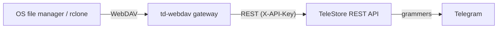

# WebDAV Gateway (Track D extension exercise)

Goal: expose your Telegram drive as a **WebDAV** mount so any OS file manager
(Windows "Map network drive", macOS Finder "Connect to Server", Linux GVFS /
`rclone`) can browse and transfer files — no custom client needed.

This is a design + scaffold, not a finished implementation. It builds directly
on the existing REST API, so most of the work is verb translation.

## Architecture



Run the gateway next to `td-headless` (or point it at the desktop app's API).
It is a thin adapter: WebDAV requests in, REST calls out.

## Verb mapping

| WebDAV method | Maps to REST | Notes |
| --- | --- | --- |
| `PROPFIND` (depth 0/1) | `GET /folders`, `GET /files?folder_id=` | Build the directory listing; report size + mtime from file metadata. |
| `GET` | `GET /files/{message_id}/download` | Supports `Range` (the API streams with byte ranges). |
| `PUT` | `POST /files` (multipart) | Stream the body to an upload; pick `folder_id` from the path. |
| `DELETE` | `DELETE /files/{message_id}` or `DELETE /folders/{id}` | |
| `MKCOL` | `POST /folders` | Create a channel-backed folder. |
| `MOVE` | `PATCH /files/{message_id}` (folder_id) or `PATCH /folders/{id}` (rename) | |
| `COPY` | `POST /files/{message_id}/copy` | |
| `PROPPATCH`, `LOCK`, `UNLOCK` | no-op / 200 | Telegram has no locking; return success to satisfy clients. |

### Path → ID mapping

WebDAV is path-based (`/Documents/report.pdf`) but Telegram is ID-based
(folder channel id + message id). Maintain a path↔id index:

- Folders: `GET /folders` returns `{id, name}`; map `/<name>` → folder_id.
- Files: within a folder, map `<name>` → message_id via `GET /files?folder_id=`.
- Cache the mapping with a short TTL; fall back to a fresh listing on miss.
- Handle duplicate names (Telegram allows them) by disambiguating with the
  message id, e.g. `report (123).pdf`.

## Suggested implementation

Use the [`dav-server`](https://crates.io/crates/dav-server) crate, which
provides the WebDAV protocol layer and lets you implement a custom `DavFileSystem`
backend. The backend methods call the REST API (via `reqwest`).

Sketch (feature-gate behind `webdav`, add a `[[bin]] td-webdav`):

```rust
// src/bin/td-webdav.rs  (feature = "webdav")
// 1. Read TD_API_BASE / TD_API_KEY (same as td-cli).
// 2. Implement dav_server::fs::DavFileSystem:
//      - read_dir  -> GET /folders, GET /files?folder_id=
//      - open      -> GET /files/{id}/download (ranged reads)
//      - create    -> POST /files (multipart)
//      - remove    -> DELETE ...
//      - rename    -> PATCH ...
// 3. Serve with warp/hyper:  dav_server::DavHandler + your fs + a locksystem
//      (FakeLs is fine — Telegram has no real locks).
// 4. Bind to 127.0.0.1 only; reuse Caddy/Tailscale for any remote access.
```

Recommended deps (when implementing):

```toml
[features]
webdav = ["dep:dav-server", "dep:hyper", "dep:warp"]
[dependencies]
dav-server = { version = "0.7", optional = true }
hyper = { version = "1", optional = true }
warp = { version = "0.3", optional = true }
```

## Gotchas

- **Encrypted files:** if you enable Track C E2E encryption, the gateway must
  decrypt on `GET` and encrypt on `PUT`, and cannot honor `Range` for encrypted
  blobs (decrypt requires the whole object). Expose encrypted files as
  non-seekable.
- **Large files / timeouts:** WebDAV clients can be impatient; stream and send
  `Content-Length` where known (the REST download sets it).
- **Auth:** WebDAV Basic auth → translate the password to the `X-API-Key`
  header, or terminate auth at Caddy and keep the gateway on loopback.
