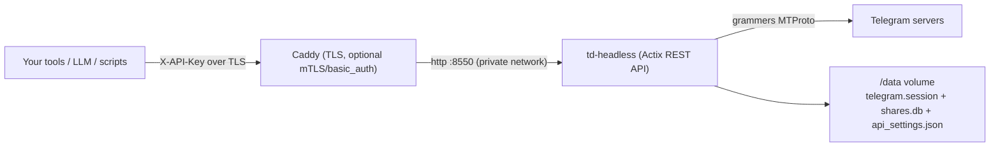

# TeleStore — Self-Hosting the Headless API (Track B)

This directory contains everything to run the TeleStore **REST API** as a
background service (Docker), without the desktop GUI. It reuses the exact route
handlers from the desktop app via a feature-gated `td-headless` binary.

> The headless server does **not** implement interactive login (phone code / QR).
> You authenticate **once** with the desktop app, then hand the session to the
> headless service.

## Architecture



## One-time setup

1. **Authenticate + configure the API in the desktop app**
   - Launch the desktop build, log in to Telegram.
   - Open Settings → enable the **REST API**, set a strong **API key**, note the port.
   - This writes `telegram.session`, `shares.db`, and `api_settings.json` into the
     desktop app-data directory:
     - Windows: `%APPDATA%\com.telestore.app`
     - macOS: `~/Library/Application Support/com.telestore.app`
     - Linux: `~/.local/share/com.telestore.app`

2. **Copy the session/state into `./data`**
   ```bash
   mkdir -p selfhost/data
   cp "<app-data-dir>/telegram.session"  selfhost/data/
   cp "<app-data-dir>/shares.db"         selfhost/data/   # optional but recommended
   cp "<app-data-dir>/api_settings.json" selfhost/data/
   ```

3. **Set your `api_id`**
   ```bash
   cp selfhost/.env.example selfhost/.env
   # edit selfhost/.env and set TD_API_ID=<your numeric api_id>
   ```

4. **Build & run**
   ```bash
   cd selfhost
   docker compose up -d --build
   ```

5. **Test**
   ```bash
   curl -k https://localhost:8443/api/v1/health
   curl -k -H "X-API-Key: <your key>" https://localhost:8443/api/v1/files
   ```

## Running the binary without Docker

```bash
cd app && npm ci && npm run build          # produces app/dist (embedded at compile time)
cd src-tauri
cargo build --release --features headless --bin td-headless

TD_DATA_DIR=/path/to/data \
TD_API_ID=123456 \
TD_BIND=127.0.0.1 \
TD_PORT=8550 \
./target/release/td-headless
```

## Security posture (read this)

- The TeleStore API key (`X-API-Key`) is the **only** application gate, and there
  is **no rate limiting**. Treat the endpoint as sensitive.
- **Do not** publish it on the open internet. Preferred options:
  - Bind Caddy's published port to your **Tailscale** IP only (edit the `ports:`
    mapping in `docker-compose.yml` to `100.x.y.z:8443:8443`), so only your
    tailnet can reach it.
  - Or add **mTLS** / **basic_auth** in the `Caddyfile` (templates included).
- The container runs as a non-root user and only the `/data` volume is writable.

## Backup strategy

The only irreplaceable state lives in the `/data` volume:

| File                 | What it is                                  | Sensitivity |
| -------------------- | ------------------------------------------- | ----------- |
| `telegram.session`   | grammers auth session (account access!)     | **Critical / secret** |
| `api_settings.json`  | API key hash + port                          | Sensitive   |
| `shares.db`          | share links + folder metadata/grouping       | Important   |
| `bandwidth.json`     | daily transfer counters                      | Trivial     |
| `cache/`             | regenerable thumbnails/previews              | Disposable  |

Recommended: an encrypted, off-box snapshot of `telegram.session`, `shares.db`,
and `api_settings.json`. Example with [`restic`](https://restic.net):

```bash
# one-time
export RESTIC_REPOSITORY=sftp:backup-host:/backups/telestore
export RESTIC_PASSWORD_FILE=/root/.restic-pass
restic init

# scheduled (cron / systemd timer)
restic backup \
  selfhost/data/telegram.session \
  selfhost/data/shares.db \
  selfhost/data/api_settings.json
restic forget --keep-daily 7 --keep-weekly 4 --prune
```

Notes:
- `telegram.session` grants full access to your Telegram account — store backups
  **encrypted** and treat them like a password.
- `cache/` and `bandwidth.json` do **not** need backing up.
- To rotate access, log out in the desktop app (invalidates the session) and
  re-seed `/data`, then `docker compose restart`.
